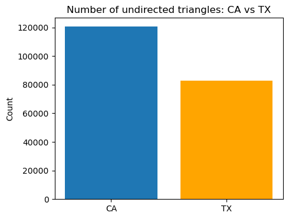
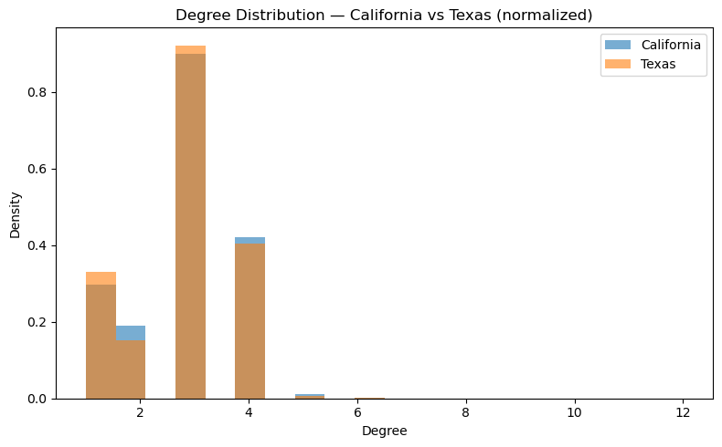
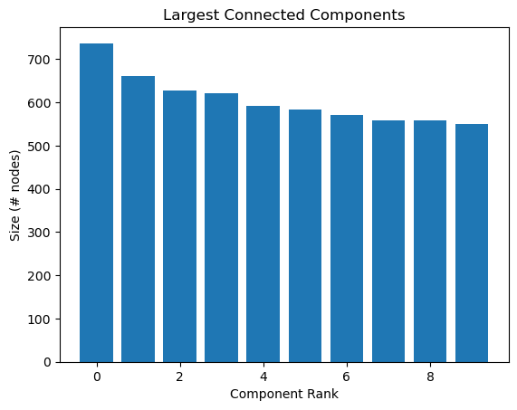
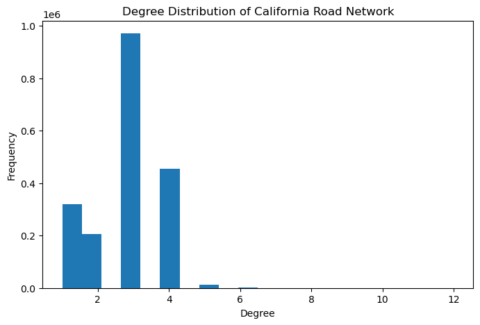

# Road Network Motif Analysis with PySpark

Large-scale graph analysis project using PySpark to identify structural patterns in road networks, with focus on degree distribution, connected components, and motif detection (paths and triangles).

## Project Highlights

- Processed large-scale road network datasets from SNAP using PySpark  
- Built a graph preprocessing pipeline from raw edge list files  
- Applied motif finding techniques to detect paths and triangles  
- Compared structural patterns between California and Texas road networks  
- Analysed graph topology through degree distributions and connectivity  

---

## Overview

This project analyses two large road network datasets from the Stanford Network Analysis Project (SNAP): California and Texas.

The goal is to identify recurring structural patterns (motifs) and understand the topology of transportation networks through graph analysis techniques.

---

## Objectives

- Load and clean raw road network data  
- Construct undirected graph representations  
- Analyse node degree distributions  
- Identify connected components  
- Detect graph motifs such as:
  - 2-step paths (A → B → C)
  - Triangles (closed triplets)  
- Compare results across different networks  

---

## Dataset

Source: https://snap.stanford.edu/data/

Datasets used:
- `roadNet-CA`
- `roadNet-TX`

These represent road networks where:
- Nodes = intersections  
- Edges = road connections  

---

## Tools & Technologies

- Python  
- PySpark  
- Matplotlib  
- NumPy  

---

## Project Structure

- `notebooks/01_road_network_motif_analysis.ipynb` → full analysis workflow  
- `images/` → visual outputs used in this README  

---

## Methodology

The analysis follows these main steps:

1. Read raw edge list data and remove comment lines  
2. Clean and normalize edges:
   - remove self-loops  
   - convert to undirected format  
   - remove duplicates  
3. Build vertex set  
4. Compute degree distribution  
5. Identify connected components  
6. Detect motifs:
   - paths of length 2  
   - triangles  
7. Compare California vs Texas  

---

## Key Features

- Graph preprocessing pipeline  
- Degree distribution analysis  
- Connected component detection  
- Motif detection (paths & triangles)  
- Cross-network comparison  

---

## Key Insights

- Road networks exhibit sparse connectivity with low average node degree  
- Most nodes represent simple intersections with limited connections  
- Large connected components dominate both networks  
- Triangle motifs are relatively limited compared to social networks  
- California shows a higher number of triangle motifs than Texas  

---

## Example Outputs

### Triangle Motif Comparison
Shows the number of triangle motifs detected in each network.

---

### Degree Distribution — California vs Texas
Compares normalized degree distributions across both networks.

---

### Connected Components
Shows the size of the largest connected components.

---

### Degree Distribution (California)
Illustrates how node connectivity is distributed in the California network.

---

## How to Run

1. Download datasets from SNAP  
2. Update file paths in the notebook  
3. Start a Spark session  
4. Run the notebook step by step  

---

## Notes

This project was developed for the course **Big Data and Smart Data Analytics**.

---

## Author

Sara Silva
